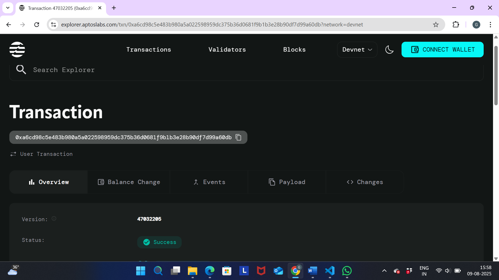

# Contract Version Manager

## Project Description

The Contract Version Manager is a smart contract built on the Aptos blockchain that provides a decentralized solution for tracking and managing different versions of smart contracts. This system allows contract owners to maintain a comprehensive version history, update to new versions seamlessly, and ensure transparency in contract evolution over time.

## Project Vision

Our vision is to create a reliable, transparent, and decentralized infrastructure for smart contract version management on the Aptos ecosystem. By providing developers with tools to track contract versions, we aim to enhance trust, facilitate debugging, and improve the overall development experience in the blockchain space.

## Key Features

- **Version Registry Initialization**: Create a new contract version registry with an initial version
- **Version Updates**: Seamlessly update contracts to new versions while maintaining complete history
- **Owner-Only Access**: Secure version management with owner-only update permissions
- **Version History Tracking**: Comprehensive logging of all contract versions for audit trails
- **Active Status Management**: Track whether contracts are currently active or deprecated
- **Error Handling**: Robust error management with specific error codes for different scenarios

## Future Scope

- **Multi-Owner Support**: Enable multiple authorized users to manage contract versions
- **Version Rollback**: Implement functionality to rollback to previous versions
- **Automated Testing Integration**: Connect with testing frameworks for version validation
- **Version Approval Workflow**: Multi-signature approval process for critical version updates
- **Cross-Chain Compatibility**: Extend support to other blockchain networks
- **Version Metadata**: Add support for release notes, timestamps, and detailed version information
- **Integration APIs**: Develop APIs for easy integration with development tools and CI/CD pipelines
- **Governance Integration**: Community voting mechanisms for public contract version updates

## Contract Details

0xa6cd98c5e483b980a5a022598959dc375b36d0681f9b1b3e28b90df7d99a60db
